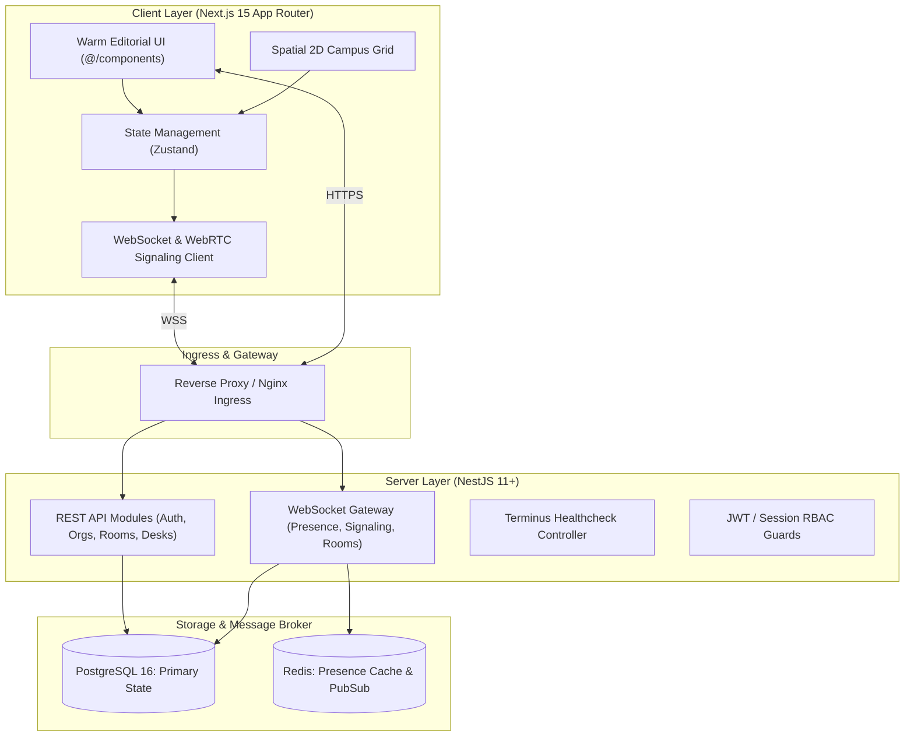

# System Architecture and Technology Blueprint

## Project: realntoffice
**Architecture Version:** 1.0.0  
**Stack Alignment:** Next.js (Client) + NestJS (Server) + PostgreSQL (Databases) + Puppeteer (E2E Tests) + Docker (Deployment)

---

## 1. High-Level System Architecture



---

## 2. Monorepo Directory Organization

Per strict architectural constraints, the repository root enforces an isolated, clean directory structure:

```text
realntoffice/
├── README.md              # Project overview, quickstart, and design guidelines
├── LICENSE                # Open source MIT license
├── docs/                  # Architectural specs, PRD, right/anti-patterns
│   ├── PRD.md
│   ├── ARCHITECTURE.md
│   └── RIGHT_AND_ANTI_PATTERNS.md
├── client/                # Next.js frontend (App Router, Tailwind CSS, Default Design)
├── server/                # NestJS backend (REST API, WebSockets, Domain Modules)
├── databases/             # PostgreSQL migrations, schema DDL, seeds, and init SQL
│   ├── 01_init.sql
│   ├── 02_tables.sql
│   └── 03_seed.sql
├── tests/                 # Automated test suites (Puppeteer E2E, Unit, Integration)
│   ├── e2e/
│   │   ├── presence.e2e.spec.js
│   │   └── office_navigation.e2e.spec.js
│   └── package.json
├── scripts/               # Operational utility scripts
│   ├── screenshot_crawler.js
│   ├── docs_builder.ts
│   └── health_check.sh
└── deployment/            # Production & local container orchestration
    ├── Dockerfile.client
    ├── Dockerfile.server
    ├── docker-compose.yml
    ├── deploy.sh
    └── redeploy.sh
```

---

## 3. Data Tier Specification (PostgreSQL)

### 3.1 Primary Relational Schemas
1. **`organizations`**: Multi-tenant workspace entities with domain configuration.
2. **`users`**: User identities, credentials, profile metadata, and organizational role.
3. **`campuses`**: Physical or logical office locations within an organization.
4. **`floors`**: Spatial levels hosting zones, rooms, and desk grids.
5. **`zones`**: Logical groupings (e.g., Engineering, Executive, Social, Focus).
6. **`rooms`**: Audio/video meeting spaces with capacity constraints.
7. **`desks`**: Individual work points assignable as permanent or hot-desk.
8. **`presence_logs`**: Debounced chronological session history for audit and analytics.
9. **`room_artifacts`**: Persistent notes, decision logs, and meeting summaries.

---

## 4. WebSocket Signaling and Real-Time Event Contracts

All real-time events conform to a typed payload contract:

| Event Name | Direction | Payload Contract | Description |
| :--- | :--- | :--- | :--- |
| `presence:join` | Client -> Server | `{ floorId: string, deskId?: string, status: string }` | Member checks into a floor or desk |
| `presence:heartbeat` | Client -> Server | `{ clientTimestamp: number }` | Periodic 30s liveness beacon |
| `presence:state_sync` | Server -> Client | `{ floorId: string, occupants: OccupantDTO[] }` | Full or differential floor occupants |
| `presence:moved` | Server -> Client | `{ userId: string, x: number, y: number, zoneId: string }` | Viewport-scoped coordinate update |
| `knock:send` | Client -> Server | `{ targetUserId: string, message?: string }` | Direct soft knock on a colleague's desk |
| `knock:received` | Server -> Client | `{ fromUser: UserSummaryDTO, knockId: string }` | Notification delivered to recipient |
| `knock:respond` | Client -> Server | `{ knockId: string, status: 'accept' \| 'busy' \| 'later' }` | Response payload resolving knock |
| `room:join` | Client -> Server | `{ roomId: string, audioMuted: boolean, videoMuted: boolean }` | Join meeting room audio/video space |
| `room:signal` | Bidirectional | `{ roomId: string, targetPeerId: string, signalData: any }` | WebRTC ICE candidate or SDP exchange |

---

## 5. Security & Isolation Matrix

* **Authentication**: JWT with asymmetric RS256 signatures, short expiration (15m), and secure httpOnly refresh cookie.
* **Authorization**: Fine-grained Casbin/RBAC decorators on all NestJS controller endpoints (`@Roles('ADMIN', 'FLOOR_MANAGER')`).
* **Tenant Isolation**: Row-Level Security (RLS) policies enforcing `organization_id` partitioning on all queries.
* **Network Hardening**: Strict Content Security Policy (CSP), CORS whitelisting, and rate-limiting via NestJS Throttler.
