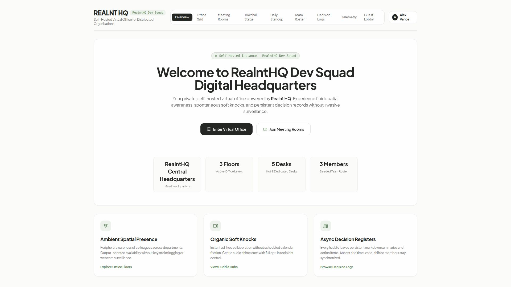
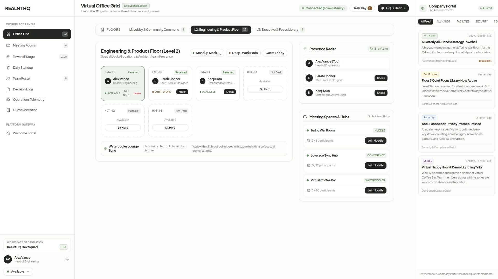
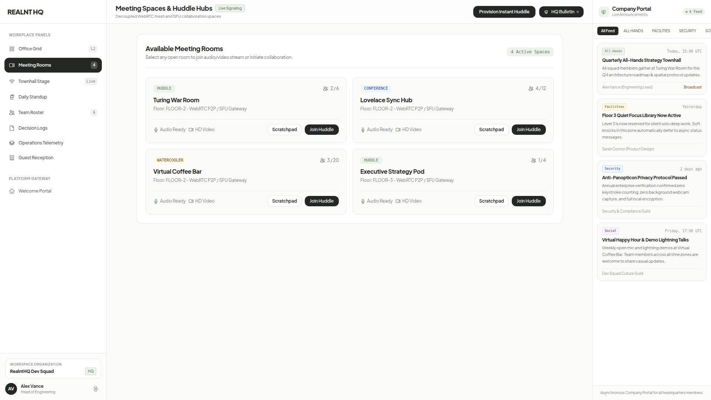
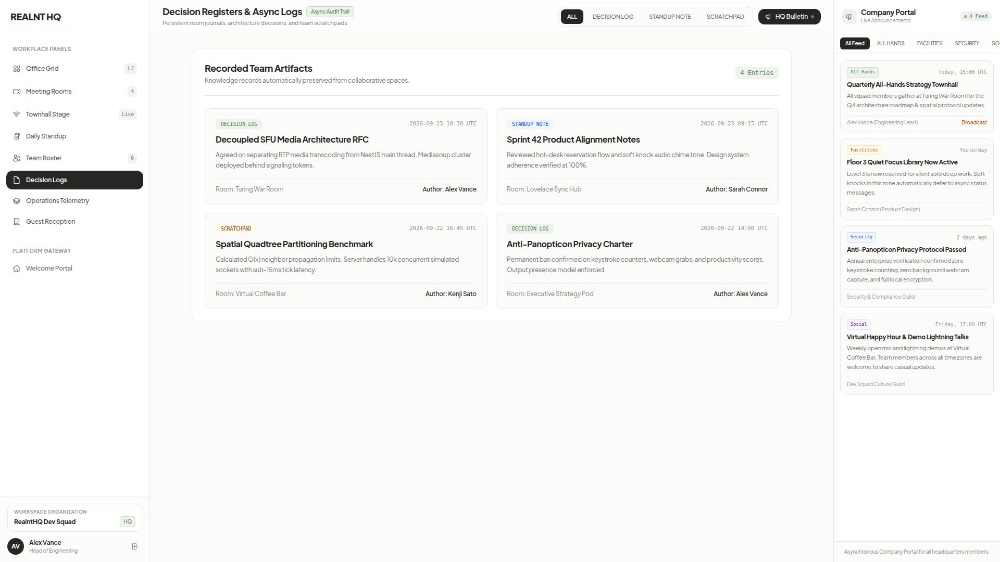
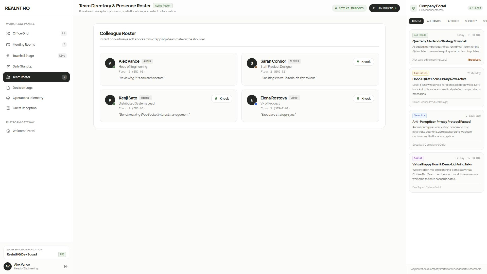
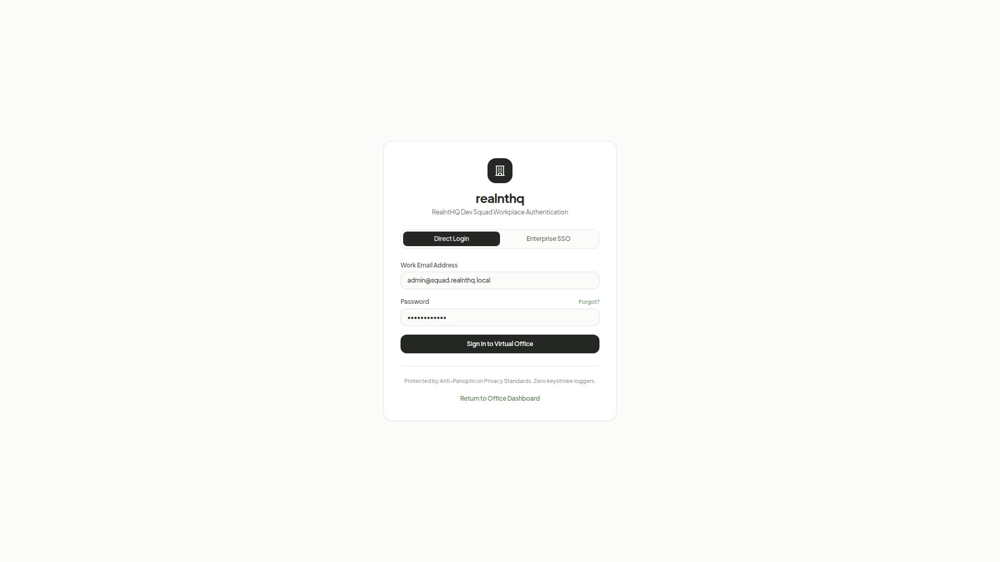
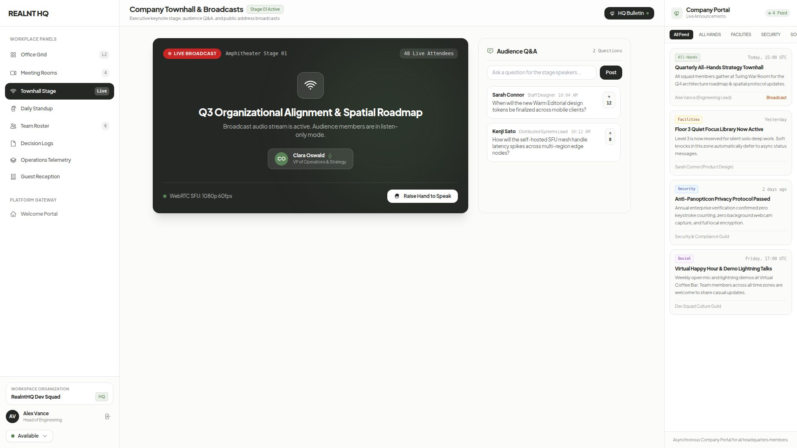
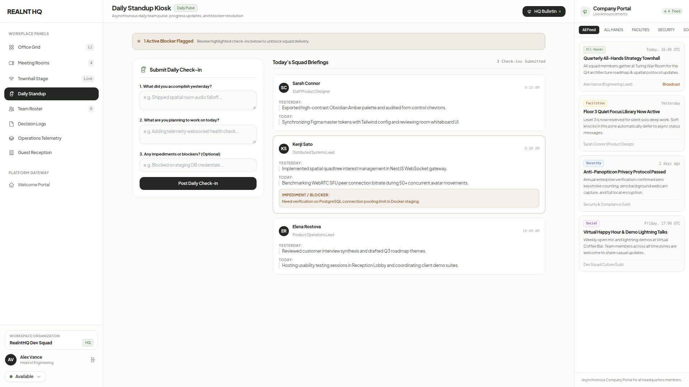
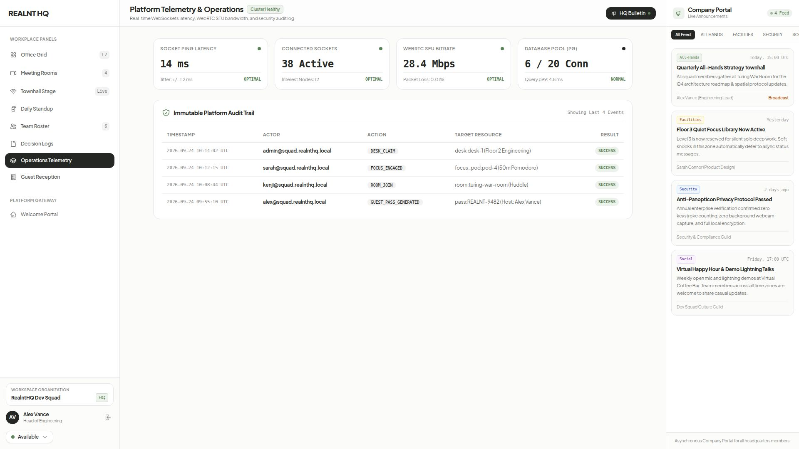
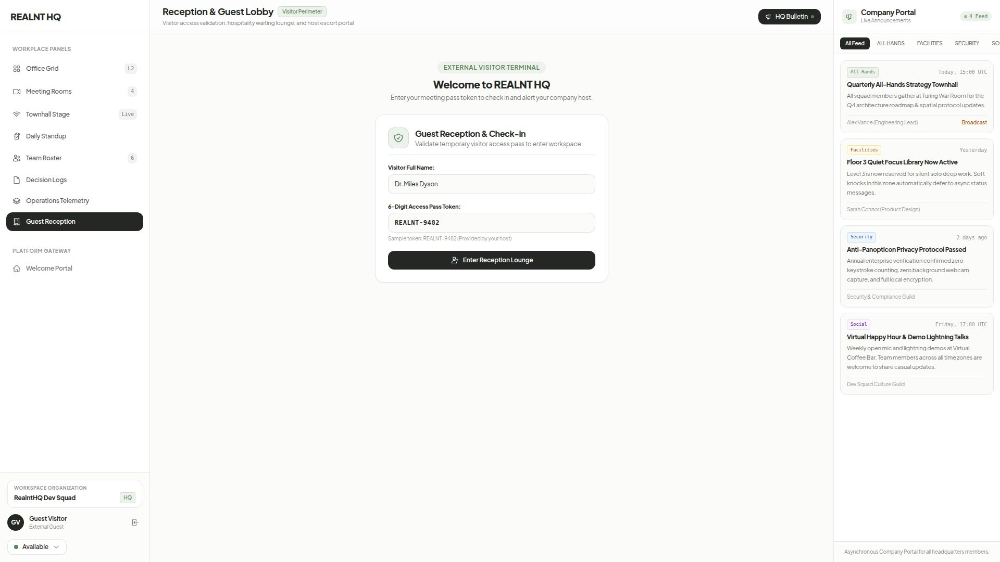

# realnthq: Visual Interface Catalogue

**Document Purpose:** Complete visual preview archive and interface index for the `realnthq` virtual office platform.
**Design System Baseline:** Warm Editorial Light (`#fbfbfa` canvas, Plus Jakarta Sans headlines, Inter / DM Sans UI, solid obsidian actions, soft sage accents).
**Viewport Resolution:** 1920x1080 (16:9 Desktop Full-Fidelity).

---

## Archival Package Download

* **Complete Screenshot Bundle (ZIP)**: [Download realnthq.zip](./screenshots/zip/realnthq.zip)

---

## Table of Contents

* [01. Welcome Landing Page & Headquarters Hub](#01-landing-page)
* [02. Virtual Office Floor & Desk Grid](#02-office-grid)
* [03. Meeting Spaces & Huddle Hubs](#03-meeting-rooms)
* [04. Decision Registers & Async Artifacts](#04-decision-logs)
* [05. Team Directory & Spatial Presence Roster](#05-team-directory)
* [06. Single Sign-On & Authentication Portal](#06-workspace-login)
* [07. Company Townhall & Amphitheater Stage](#07-townhall-stage)
* [08. Asynchronous Daily Standup Kiosk](#08-daily-standup)
* [09. Platform Telemetry & Operations](#09-platform-telemetry)
* [10. Guest Reception & Hospitality Lounge](#10-guest-reception)

---

## 01. Welcome Landing Page & Headquarters Hub

* **Route:** `/` ([http://localhost:3000/](http://localhost:3000/))
* **File:** [`docs/preview/screenshots/01-landing-page.jpg`](./screenshots/01-landing-page.jpg)
* **Core Components:** `Header`, `WelcomeBanner`, `DynamicOrgBadge`, `OfficeStats`, `ActionGateways`, `FeatureHighlights`

> **Architecture & UI Note**: Dedicated self-hosted welcoming portal greeting team members of the host organization (e.g. RealntHQ Dev Squad) with dynamic company data, office statistics, and direct action gateways powered by Realnt HQ.

---

## 02. Virtual Office Floor & Desk Grid

* **Route:** `/office` ([http://localhost:3000/office](http://localhost:3000/office))
* **File:** [`docs/preview/screenshots/02-office-grid.jpg`](./screenshots/02-office-grid.jpg)
* **Core Components:** `Sidebar`, `DashboardLayout`, `BulletinPanel`, `FloorSelector`, `OfficeGrid`, `DeskTile`, `PresenceRadar`, `RoomPanel`, `StatusSelector`

> **Architecture & UI Note**: Interactive 2D virtual office canvas featuring persistent left sidebar navigation, multi-floor selection, real-time desk claims, spatial presence radar, and right-hand company announcements bulletin.

---

## 03. Meeting Spaces & Huddle Hubs

* **Route:** `/rooms` ([http://localhost:3000/rooms](http://localhost:3000/rooms))
* **File:** [`docs/preview/screenshots/03-meeting-rooms.jpg`](./screenshots/03-meeting-rooms.jpg)
* **Core Components:** `Sidebar`, `DashboardLayout`, `BulletinPanel`, `ActiveHuddle`, `VideoIcon`, `MicIcon`, `UsersIcon`

> **Architecture & UI Note**: Collaborative rooms supporting persistent left sidebar navigation, P2P mesh and SFU gateway signaling, capacity tracking, active meeting indicators, and right-hand company announcements bulletin.

---

## 04. Decision Registers & Async Artifacts

* **Route:** `/artifacts` ([http://localhost:3000/artifacts](http://localhost:3000/artifacts))
* **File:** [`docs/preview/screenshots/04-decision-logs.jpg`](./screenshots/04-decision-logs.jpg)
* **Core Components:** `Sidebar`, `DashboardLayout`, `BulletinPanel`, `ArtifactFilter`, `DecisionCard`, `MarkdownViewer`

> **Architecture & UI Note**: Persistent room-level markdown records, architectural decisions, and daily standup journals embedded inside the panel workspace layout with company announcements bulletin.

---

## 05. Team Directory & Spatial Presence Roster

* **Route:** `/team` ([http://localhost:3000/team](http://localhost:3000/team))
* **File:** [`docs/preview/screenshots/05-team-directory.jpg`](./screenshots/05-team-directory.jpg)
* **Core Components:** `Sidebar`, `DashboardLayout`, `BulletinPanel`, `TeamCard`, `StatusBadge`, `KnockTrigger`, `KnockModal`

> **Architecture & UI Note**: Comprehensive organizational roster showing member roles, desk locations, live availability indicators, and right-hand company announcements bulletin.

---

## 06. Single Sign-On & Authentication Portal

* **Route:** `/login` ([http://localhost:3000/login](http://localhost:3000/login))
* **File:** [`docs/preview/screenshots/06-workspace-login.jpg`](./screenshots/06-workspace-login.jpg)
* **Core Components:** `LoginForm`, `SSOButtons`, `OfficeBranding`, `PrivacyNotice`

> **Architecture & UI Note**: Enterprise authentication gate supporting Okta / SAML SSO, Google Workspace, GitHub Org, and direct magic-link login with zero-surveillance compliance.

---

## 07. Company Townhall & Amphitheater Stage

* **Route:** `/broadcasts` ([http://localhost:3000/broadcasts](http://localhost:3000/broadcasts))
* **File:** [`docs/preview/screenshots/07-townhall-stage.jpg`](./screenshots/07-townhall-stage.jpg)
* **Core Components:** `Sidebar`, `DashboardLayout`, `BroadcastStage`, `BroadcastQa`, `BulletinPanel`

> **Architecture & UI Note**: Executive broadcast stage for live company all-hands, moderated audience Q&A, and company-wide announcements.

---

## 08. Asynchronous Daily Standup Kiosk

* **Route:** `/standup` ([http://localhost:3000/standup](http://localhost:3000/standup))
* **File:** [`docs/preview/screenshots/08-daily-standup.jpg`](./screenshots/08-daily-standup.jpg)
* **Core Components:** `Sidebar`, `DashboardLayout`, `StandupComposer`, `StandupCard`, `BlockerBanner`

> **Architecture & UI Note**: Daily squad pulse terminal featuring 3-field check-in submission, blocker resolution highlights, and team briefings.

---

## 09. Platform Telemetry & Operations

* **Route:** `/telemetry` ([http://localhost:3000/telemetry](http://localhost:3000/telemetry))
* **File:** [`docs/preview/screenshots/09-platform-telemetry.jpg`](./screenshots/09-platform-telemetry.jpg)
* **Core Components:** `Sidebar`, `DashboardLayout`, `TelemetryMetrics`, `AuditLogTable`

> **Architecture & UI Note**: Real-time WebSocket connection ping latency, WebRTC SFU bitrates, database connection pools, and immutable security audit trail.

---

## 10. Guest Reception & Hospitality Lounge

* **Route:** `/lobby` ([http://localhost:3000/lobby](http://localhost:3000/lobby))
* **File:** [`docs/preview/screenshots/10-guest-reception.jpg`](./screenshots/10-guest-reception.jpg)
* **Core Components:** `DashboardLayout`, `GuestCheckinCard`, `WaitingLounge`, `ShieldCheckIcon`

> **Architecture & UI Note**: External visitor access terminal validating 6-digit guest tokens, notifying internal hosts, and hosting visitors in sandboxed lounges.

---
