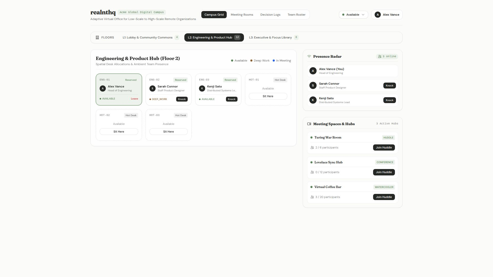
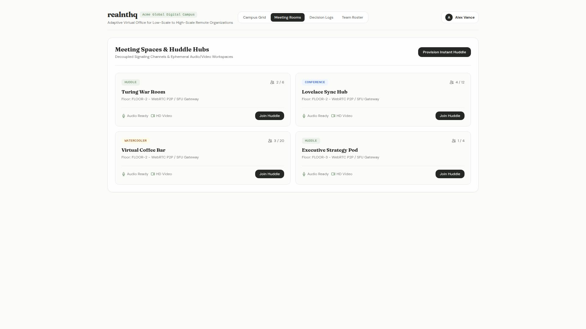
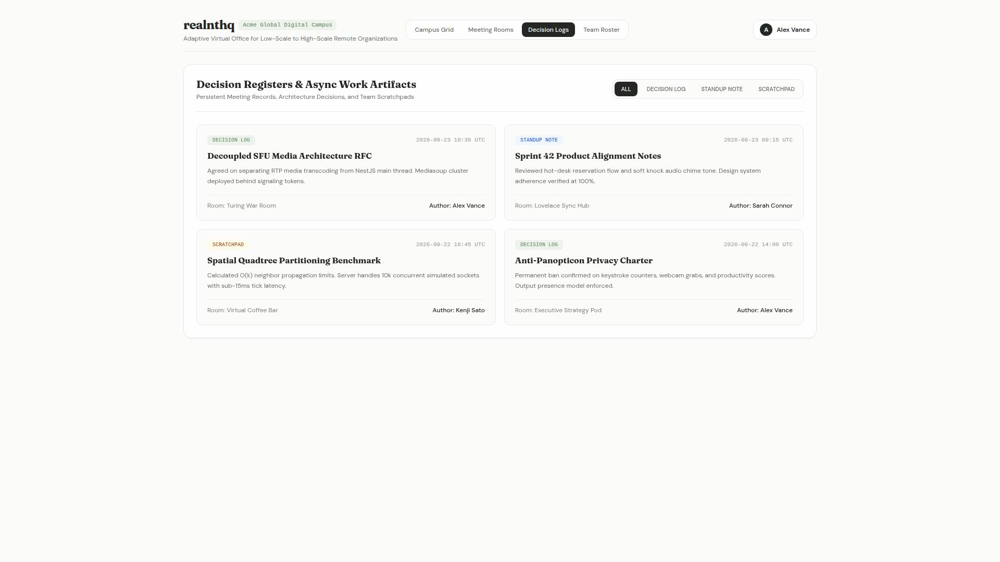
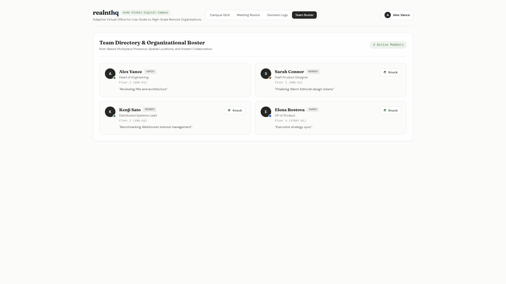
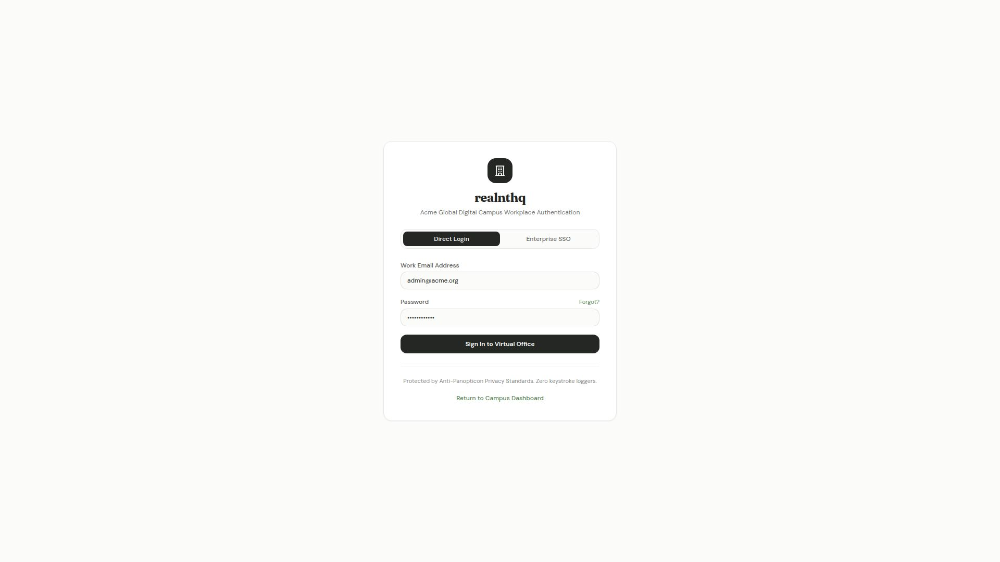

# realnthq: Visual Interface Catalogue

**Document Purpose:** Complete visual preview archive and interface index for the `realnthq` virtual office platform.
**Design System Baseline:** Warm Editorial Light (`#fbfbfa` canvas, Fraunces serif, DM Sans UI, solid obsidian actions, soft sage accents).
**Viewport Resolution:** 1920x1080 (16:9 Desktop Full-Fidelity).

---

## Archival Package Download

* **Complete Screenshot Bundle (ZIP)**: [Download realnthq.zip](./screenshots/zip/realnthq.zip)

---

## Table of Contents

* [01. Virtual Campus Floor & Desk Grid](#01-virtual-campus)
* [02. Meeting Spaces & Huddle Hubs](#02-meeting-rooms)
* [03. Decision Registers & Async Artifacts](#03-decision-logs)
* [04. Team Directory & Spatial Presence Roster](#04-team-directory)
* [05. Single Sign-On & Authentication Portal](#05-workspace-login)

---

## 01. Virtual Campus Floor & Desk Grid

* **Route:** `/` ([http://localhost:3000/](http://localhost:3000/))
* **File:** [`docs/preview/screenshots/01-virtual-campus.jpg`](./screenshots/01-virtual-campus.jpg)
* **Core Components:** `Header`, `FloorSelector`, `CampusGrid`, `DeskTile`, `PresenceRadar`, `RoomPanel`, `StatusSelector`

> **Architecture & UI Note**: Interactive 2D virtual office canvas featuring multi-floor selection, real-time desk claims, status tags, spatial presence radar, and ad-hoc room huddles.

---

## 02. Meeting Spaces & Huddle Hubs

* **Route:** `/rooms` ([http://localhost:3000/rooms](http://localhost:3000/rooms))
* **File:** [`docs/preview/screenshots/02-meeting-rooms.jpg`](./screenshots/02-meeting-rooms.jpg)
* **Core Components:** `Header`, `ActiveHuddle`, `VideoIcon`, `MicIcon`, `UsersIcon`

> **Architecture & UI Note**: Collaborative rooms supporting P2P mesh and SFU gateway signaling, capacity tracking, active meeting indicators, and instant huddle provisioning.

---

## 03. Decision Registers & Async Artifacts

* **Route:** `/artifacts` ([http://localhost:3000/artifacts](http://localhost:3000/artifacts))
* **File:** [`docs/preview/screenshots/03-decision-logs.jpg`](./screenshots/03-decision-logs.jpg)
* **Core Components:** `Header`, `ArtifactFilter`, `DecisionCard`, `MarkdownViewer`

> **Architecture & UI Note**: Persistent room-level markdown records, architectural decisions, and daily standup journals ensuring alignment across asynchronous and distributed team members.

---

## 04. Team Directory & Spatial Presence Roster

* **Route:** `/team` ([http://localhost:3000/team](http://localhost:3000/team))
* **File:** [`docs/preview/screenshots/04-team-directory.jpg`](./screenshots/04-team-directory.jpg)
* **Core Components:** `Header`, `TeamCard`, `StatusBadge`, `KnockTrigger`, `KnockModal`

> **Architecture & UI Note**: Comprehensive organizational roster showing member roles, desk locations, live availability indicators, and direct one-click soft knock collaboration.

---

## 05. Single Sign-On & Authentication Portal

* **Route:** `/login` ([http://localhost:3000/login](http://localhost:3000/login))
* **File:** [`docs/preview/screenshots/05-workspace-login.jpg`](./screenshots/05-workspace-login.jpg)
* **Core Components:** `LoginForm`, `SSOButtons`, `CampusBranding`, `PrivacyNotice`

> **Architecture & UI Note**: Enterprise authentication gate supporting Okta / SAML SSO, Google Workspace, GitHub Org, and direct magic-link login with zero-surveillance compliance.

---
